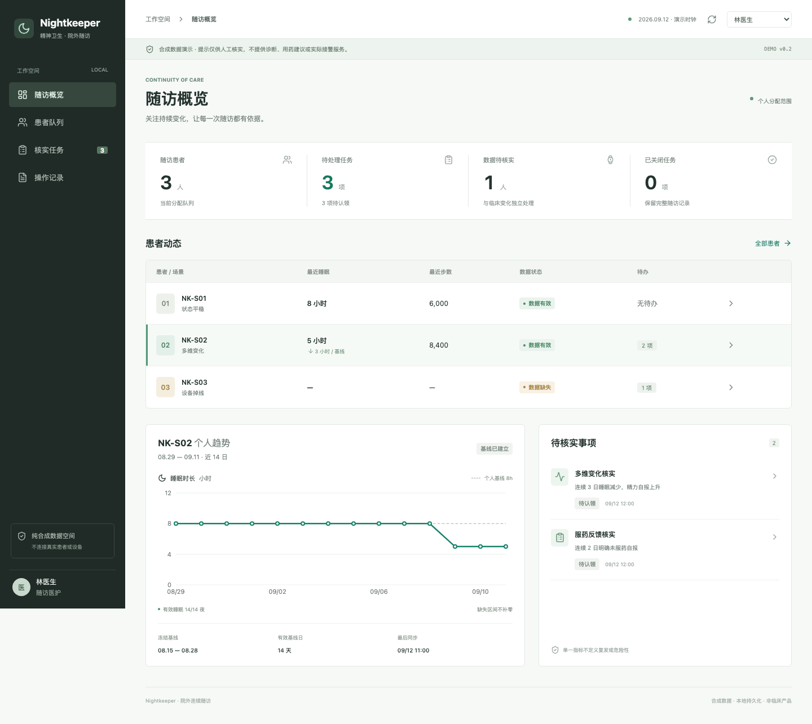

# 精神卫生院外随访工作台

面向医护人员的院外变化核实与随访管理原型。穿戴数据、患者自报和服药反馈形成可解释的核实任务，不输出诊断、复发概率或用药调整建议。

## 当前状态

- 版本：v0.2 本地可运行原型，2026-09-12；目标设计基线为v0.1。
- 已实现：医护工作台、患者反馈、三个合成案例、确定性变化规则、随访任务闭环、模板摘要、权限与审计、嵌入式PostgreSQL持久化。
- 未实现：真实设备、外部AI、独立worker、完整关系化数据库迁移、生产认证与公网部署。
- 临床状态：未获临床签署，未做真实患者试点，不是通过临床验证的产品。
- SDD 在此指 Software Design Description；后续按这些规格实施 spec-driven development。
- 项目远程仓库：https://github.com/linfuqing1107-cmd/Hackathon-Fudan-Nightkeeper

## 阅读顺序

整体介绍先读：[Nightkeeper 整体技术路线说明](docs/10-technical-roadmap.md)，包含当前实现、目标架构、大模型边界与分期规划。

1. [产品需求 PRD](docs/01-prd.md)：目标、角色、范围、页面和交付标准。
2. [行为规格 Spec](docs/02-spec.md)：编号需求、状态机、规则及验收。
3. [数据契约](docs/03-data-contract.md)：实体、字段、质量与时间口径。
4. [API 契约](docs/04-api-contract.md)：路由、访问控制、并发与错误语义。
5. [软件设计 SDD](docs/05-sdd.md)：模块、存储、事务、部署和设计决策。
6. [验证计划](docs/06-validation.md)：三个演示案例及测试矩阵。
7. [实施任务](docs/07-delivery.md)：开发顺序、进入条件、完成标准和路线图。
8. [追踪与决策](docs/08-traceability.md)：需求到设计、测试、任务的映射及待定项。
9. [实际实现与设计差异](docs/09-implementation-status.md)：优先阅读，区分目标与已交付范围。

## 演示边界

仅允许纯合成参与者及观测数据。机构历史经营统计、真实患者信息、联系方式、设备账户和密钥不得进入仓库。首版不得宣称降低复发率或替代急救服务。

提供平稳、多维变化、设备掉线三个场景。模拟数据和模板摘要明确标注，不连接真实设备或模型。患者编号S01-S03均为虚构，不对应任何个人。

## 本地运行

### 推荐：独立生产演示

```bash
npm ci
npm run demo:build
npm run demo
```

访问 http://127.0.0.1:3101 。构建输出为 `.next-demo`，数据库为 `.data/demo-production`，与下面3100开发环境隔离。只需构建一次，以后运行 `npm run demo` 即可；修改源码后重新构建。演示进程需保持运行，Ctrl+C停止。端口被占用时先停止原演示进程，不要让两个进程同时打开同一个数据库目录。

这不是可直接双击HTML的静态站点，需要本机Node和服务进程。运行不需要外部模型或设备账户。界面中的日期固定为2026-09-12，是合成场景时钟，不是机器当前日期。

### 开发模式

需要Node.js 22.12+和npm。无需Docker、厂商账户或模型密钥。

```bash
npm ci
npm run dev -- --port 3100
```

访问 http://127.0.0.1:3100 。应用只监听回环地址。首次进入自动建立独立浏览器演示空间，右上角切换演示身份。不要把这个版本通过反向代理发布到公网。

- 林医生：全部三位患者；陈医生：仅S01，用于验证分配范围。
- 患者S01-S03：只能提交自己的反馈、管理授权和发出演示请求。
- 管理员：重置当前空间、模拟恢复S03同步，不读取临床正文。

固定演示时钟是2026-09-12，基线为08-15至08-28，不随机器日期变化。数据写入被Git忽略的 `.data/nightkeeper`，刷新及重启保留；同一数据库目录不得运行多个进程。启动新实例使用单独DATA_DIR。

## 演示路径



[手机医护视图](docs/assets/mobile.png) · [患者每日反馈](docs/assets/patient-mobile.png)

1. 随访概览查看S01无待办、S02两项核实、S03仅数据质量任务。
2. 打开S02多维变化任务，查看三日睡眠和精力证据，认领任务。
3. 保存随访记录，生成并审阅模板摘要，安排回访或填写理由关闭任务。
4. 切换患者S02，提交今日感受及服药反馈；演示请求不联系真实医护。
5. 切管理员恢复S03同步，再回医护端核实关闭；也可重置全部场景。

## 验证与生产构建

```bash
npm run typecheck
npm test
npx playwright install chromium
npm run test:e2e
npm run build
npm start -- --port 3100
```

构建或启动前关闭使用相同端口/数据库的开发进程。Playwright测试自动启动或复用3100端口，本地测试截图位于被忽略的test-results/。CI配置已提供，远程运行状态需在GitHub Actions单独查看。

请求契约：运行后访问 `/api/v1/openapi`。核心代码在 `src/lib/domain.ts`，接口在 `src/app/api/v1/[...path]/route.ts`，界面在 `src/components/workspace.tsx`。

下一阶段：通用批量设备接口、关系化迁移、历史回算、独立worker、生产认证。完整任务完成标准仍按实施计划执行，不因原型可运行而视为全部完成。

本地验证记录见 [v0.2 验证报告](docs/10-verification.md)。

代码许可证、竞赛评分规则和公开发布授权尚待项目负责人确定，未指定许可证不表示开放任意使用授权。
# 手表接入验证扩展

新增 [BLE 验证台与 PRD / Spec / SDD](integrations/watch/README.md)：手动选设备、实时心率、可选 RR、断线状态、报告导出。独立于合成患者数据；支持合成协议回放，真实手表兼容性待现场验收。
